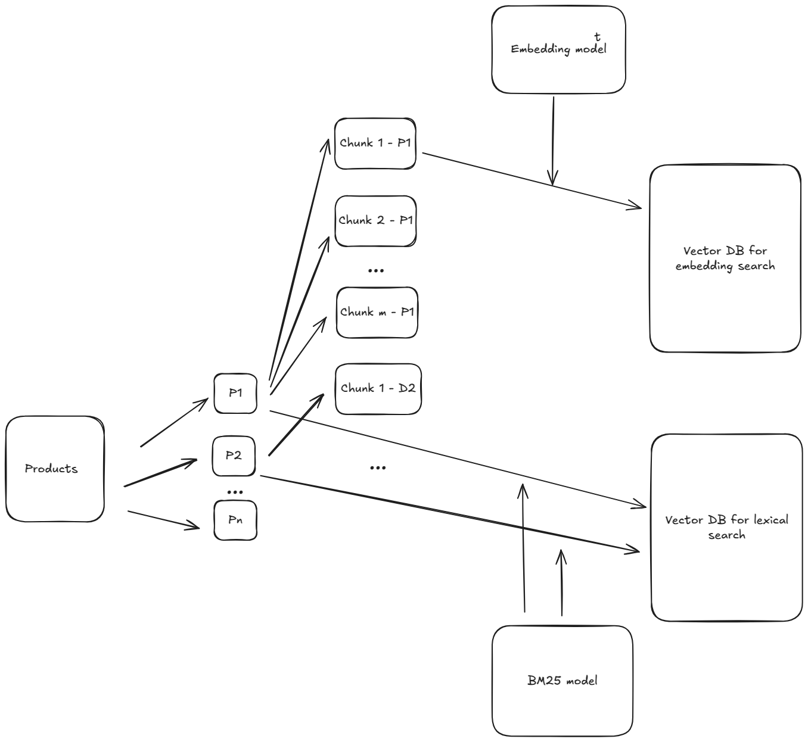
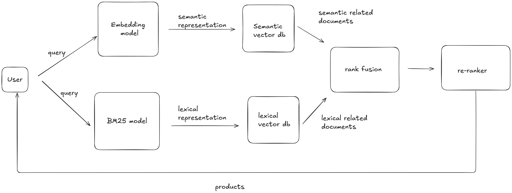

The attached python notebook implements a simple e-commerce search engine using Tf-IDF. It uses the WANDS dataset from Wayfair to evaluate the performance of the search engine using Mean Average Precision@10 (MAP).

The assignment doesn’t require you to choose the best embedding model, rather choose and approach and discuss pros and cons and what you would like to do if you have more time and resources.

It’s more about your approach than the final answer.

Test Duration: 90 - 120 minutes; This test will be evaluated based on this

Please provide responses to the following prompts:

1. The search engine in the notebook has a MAP@10 across all queries of 0.29. This is considered low. Please propose some updates to increase the score. For reference, large e-commerce websites have MAP@10 values between 0.6—0.8, although there is no expectation for your solution to be in that range. The strength of your ideas holds greater weight than the final MAP score of the solution.

One of the key components of a search engines designed for e-commerce systems is a lexical search component because of the way users query for products. Users in an e-commerce site search by keywords and this is exactly where algorithms like TF-IDF excel.

However, a lexical search algorithm is not enough because the high dimensional space generated by the TF-IDF model it won't have the key characteristic of placing related products close to each other. The TF-IDF representation will be one where products with similar keywords will be close to each other.

To mitigate this problem, a semantic search needs to be implemented along with the lexical search. The first update to the system would be storing in a VectorDB the lexical representation of each document and in another VectorDB the semantic representation of each document.

For implementing the semantic search an embedding model needs to be selected or trained. There are a few considerations when selecting an embedding model for retrieval:

-   Privacy: If data privacy is a must have then an open source model should be selected or a closed source hosted in your cloud provider such as the Cohere embedding model hosted in AWS and provided through AWS Bedrock.
-   Latency: API-based embeddings such as the ones provided by Open AI could have a bigger inference time than one hosted in your cloud.
-   Complexity: Self-hosted embedding models could have bigger deployment complexities than an API-based one or one hosted by a cloud provider.
-   Data in which was trained: There are two types of semantic searches, symmetric and asymmetric.
    -   For symmetric semantic search the query and the entries in the dataset are of about the same length and have the same amount of content. An example would be searching for similar questions.
    -   For asymmetric semantic search, the query is shorter than the paragraph you want to search. An example would be searching an answer for a given question or a few keywords.
-   Amount of dimensions: Generally, more dimensions translate to slower inference speed. However sometimes more dimensions translate to better performance. This trade-off needs to be resolved by testing multiple embedding models.
-   Memory footprint: When using a self-hosted embedding model the memory footprint of the model is one of the key factors that will define the resources and ultimately the cost.
-   Budget: Different approaches has different costs. Multiple models should be tested and for each calculate an approximation of the cost. Usually self-hosted models have lower costs but comes with the disadvantage of an increase in ML operations costs and complexity.
-   Fine-tunning requirements: If the use case requires fine-tunning of the embedding model, for example when the domain is very specific like scientific articles or medical records, then an open source model should be selected or a closed source model that offers the fine-tunning service.

When using a semantic search and a lexical search at the same time, a way of merging the results from both searches must be selected. The strategies are known as rank fusion techniques. A common used technique is known as Reciprocal rank fusion (RRF). Reciprocal Rank Fusion is a rank aggregation method that combines rankings from multiple sources into a single, unified ranking. The final answer will be the top k in this unified ranking.

Another update I would do to model is replacing TF-IDF by a BM25 model. The BM25 model is similar to TF-IDF but generally provides more accurate and robust ranking results than basic TF-IDF.

BM25 introduces parameters to control the effect of term frequency. It recognizes that after a certain number of occurrences, the relevance boost from additional occurrences of a term diminishes. Also, includes a parameter to normalize the effect of document length. It accounts for the fact that longer documents are more likely to contain query terms simply by their length, without necessarily being more relevant.

A second-iteration enhancement that can be added to the system is the introduction of a re-ranker. The re-ranker has the goal of filtering out irrelevant documents over a small number of documents. From the retriever you can get a hundred of documents that then are fed to the re-ranker to filter them and re-rank them. A re-ranker is a cross-encoder neural network designed to more accurately assess the relevance or similarity between a query and a list of documents.

A cross-encoder processes the query and each relevant document together as a single input. The cross-encoder network is trained to directly output a relevance or similarity score for each query-document pair. This score reflects how well the document matches the query.

The introduction of a re-ranker will increase performance with the disadvantage of a more complex system and the need to possibly train a cross-encoder using implicit feedback. If a user searches for a query and clicks on a specific product in the search results, this is a strong signal that the product is relevant to that query. Also, it will introduce an increase in the inference speed that can be mitigated using GPUs. Possibly for a first iteration of the system it wouldn't be the best idea to introduce the re-ranker.

In summary, we can say the system is divided into two processes, an offline step where the vector DBs are populated and an online step when a query needs to be processed. Below a diagram of the offline step can be found:

The online step would be similar to the following:

Other updates I would do for a production search engine would be:

-   Remove stop words for the lexical search.
-   An autocorrect feature to prevent typos to reduce the search performance.
-   Use approximate nearest neighbor algorithm. When working with large vector DBs comparing the query vector representation with each vector from the database is prohibitive, the process would have a time complexity of O(n\*d) where n is the amount of vector in the database and d is the dimension of the vectors. The ANN algorithm using HNSW graphs has a logarithmic time complexity O(log n).

2. Currently, partial matches are treated as irrelevant, which penalizes the model too strictly. Can you implement another function that leverages the partial match count to provide a fairer assessment of performance? Please provide a justification for why you chose this function and the tradeoffs. If you choose to implement additional evaluation metrics, please provide a justification for using them along with tradeoffs.

Evaluating the search engine only on exact matches can underestimate its performance and the value it provides to users. Users sometimes find relevant products even if they are not an exact match to their query.

When evaluating a search engine is often the case that the testing dataset does not contains information about the relevante of an item for a given query. In our use case, we do have that information and can be used to create a fairer metric. A common and direct method is computing a Weighted MAP where different weight are assigned depending on the level of relevance. This allows partial matches to contribute to the overall MAP score but with a lower weight than that assigned to exact matches. The weights should reflect the perceived value of that level of relevance from a user and business perspective.

Analyzing the distribution of the dataset the following percentages are seen: exact matches 11%, partial matches 63% and irrelevant 26%. This distribution suggests that exact and irrelevant matches are relatively infrequent, while partial results are more common. An initial weighting scheme that might be razonable is assigning a 1.0 weight to exact matches, a 0.5 weight to partial matches and a weight of 0.0 to irrelevant results.

3. For this prompt you can choose one of two options, but you DO NOT need to do both. We value the ability to improve model performance and refactor code equally, so please choose based on what you feel most comfortable doing:

    - Please implement at least one change you suggest for prompt 1 to demonstrate an improvement in the MAP score. Please document your code changes with comments and markdown cells so we can follow your thought process.

    - Please modify the code to make it more object oriented, more flexible to accommodate changes to the retrieval model, and getting it ready for production (such as adding logging, error handling, etc.)

The change implemented is the semantic search. The sentence embedding model chosen is 'Snowflake/snowflake-arctic-embed-m' because of it's good performance considering that is a model with 109M parameters. See: https://huggingface.co/Snowflake/snowflake-arctic-embed-m.

This model can embed up to 512 tokens. Analyzing the products description and product name, it's seen that some products have over 4317 characters. A generally rule of thumb used is consider the ratio of characters to token at 3:1, so we have up to 1536 characters that the model will be able to embed without losing information. 

To handle the products with longer information, a text splitter from LangChain is used. The max length is set to 1536 characters and an overlap of 50% is added so no context is lost during splitting.

The semantic search approach is done is three steps:
    1. The embedding matrix is computed
    2. For each query a semantic search is done where the query is encoded and then the cosine similarity is computed. If the product has multiple chunks, then the most similar chunk is held.
    3. Then the results are sorted by descending order of relevance and sliced to top_n=10
    4. The MAP and Weighted MAP metrics are computed

As expected the semantic search has a better performance over the lexical search. 

Please ensure your version of the notebook is reproducible in its entirety. We recommend restarting the kernel and running all the cells to ensure your results are reproducible before emailing the file back to us.

Some logistical information:

-   Please email a copy of your notebook within 7 days with your code and comments.
-   You do not need to send the data files with your notebook.
-   You will need pandas 1.5.3, scikit-learn 1.3.2, and numpy 1.3.0 to run the code, although any 1.x.x version of these packages should work.
-   You can use any open-source packages or publicly accessible APIs (only if they are well documented) to implement the changes above. Please add pip install commands for the packages/APIs you use.
-   Please do not use any proprietary code, libraries, or APIs from a current or past employer or client, unless it is licensed for public use.

-   Is there any expectation on how high the MAP score should be?

There is no expectation, just needs to be greater than 0.3, which the base model we share with them achieves. the MAP score is naturally capped at 1.0. i share in the assignment that production systems tend to have MAP of 0.6--0.9

-   The assignment talks about building a better search engine. There are multiple ways to solve them and one potential way is to use Large Langauge Models - preferably open-sourced - just checking if that is considered an option for the solution.

Yes if you are using the LLM as the retrieval function then that is totally fine

-   Could I use the Chatgpt models, such as chatgpt-3.5 or the open-accessed LLama 2 model for this assignment? I want to use the open-access LLM for performing the search/retrieval the sentence similarity search.

Yes - Thats totally fine; if you are making API calls, obfuscate or remove API keys before sending the code over to us

We wish you the best on this assignment and look forward to learning more about your ideas and improvements. Please do not hesitate to ask us questions if you hit any roadblocks in completing the assignment.
